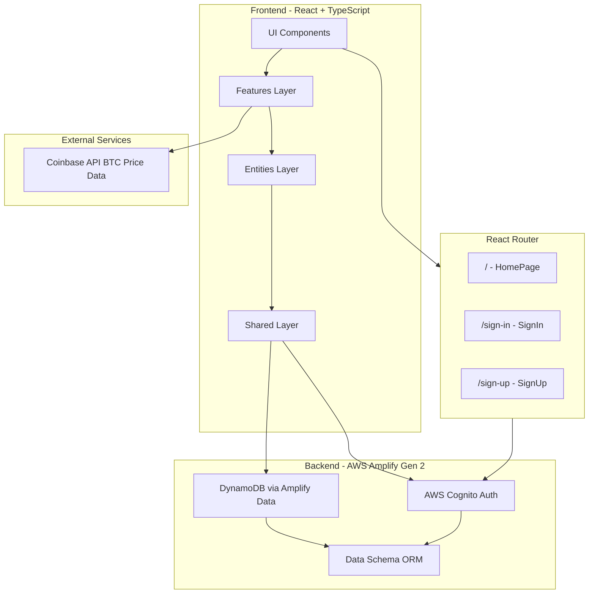

# Bitcoin Price Prediction Game - Implementation Plan

## Overview

This plan implements a full-stack Bitcoin prediction game where users predict BTC/USD price movements over 60-second intervals. The application uses AWS Amplify Gen 2 for backend infrastructure, React with TypeScript for the frontend, and follows Feature-Sliced Design (FSD) architecture.

## Architecture Overview



## Phase 1: Project Foundation & Dependencies

### 1.1 Install Core Dependencies

- **TailwindCSS**: `tailwindcss`, `postcss`, `autoprefixer` for styling
- **AWS Amplify**: `@aws-amplify/backend`, `@aws-amplify/backend-cli`, `aws-amplify` for backend and client
- **Routing**: `react-router-dom` for client-side routing
- **State Management**: `zustand` for global state
- **Icons**: `lucide-react` for iconography
- **Utilities**: `tailwind-merge`, `clsx` for className utilities
- **HTTP Client**: `axios` or native `fetch` for Coinbase API calls

### 1.2 Configure TailwindCSS

- Initialize TailwindCSS config in project root
- Update `src/index.css` with Tailwind directives
- Configure dark mode support

### 1.3 Set Up AWS Amplify Gen 2

- Initialize Amplify backend: `amplify/` directory structure
- Configure `amplify/backend.ts` entry point
- Set up Amplify CLI configuration

## Phase 2: Backend Setup (Amplify Gen 2)

### 2.1 Define Data Schema

Create `amplify/data/resource.ts`:

- **Guess Model**: `startPrice` (float), `direction` (enum: UP/DOWN), `status` (enum: PENDING/RESOLVED), `resolvedPrice` (float), `score` (integer), `createdAt`, `updatedAt`, owner authorization
  - Note: No Player model needed. Score is calculated by summing `score` field from all RESOLVED guesses for the user

### 2.2 Configure Authentication

- Set up Cognito user pool via Amplify Auth
- Configure email/password authentication
- Export auth configuration for frontend

### 2.3 Generate Amplify Client

- Amplify Gen 2 automatically generates TypeScript types from the schema
- Create shared API client instance in `src/shared/api/` using `generateClient<Schema>()`
- Use ORM methods: `client.models.Guess.create()`, `client.models.Guess.list()`, `client.models.Guess.update()`, etc.

## Phase 3: Frontend Architecture (Feature-Sliced Design)

### 3.0 Routing Architecture

The application uses react-router-dom for client-side routing:

- **`/`** (HomePage): Landing page that redirects authenticated users to game board and unauthenticated users to `/sign-in`
- **`/sign-in`** (SignIn): Sign In form, redirects to game board on successful authentication
- **`/sign-up`** (SignUp): Sign Up form, redirects to game board on successful registration

Protected routes are implemented using a wrapper component that checks authentication state and redirects accordingly.

### 3.1 Create FSD Directory Structure

```
src/
  app/              # App providers (Amplify, theme)
  pages/           # Page compositions
  widgets/         # Major UI blocks
  features/        # Business logic features
  entities/        # Domain models & UI
  shared/          # Reusable utilities
```

### 3.2 Shared Layer (`src/shared/`)

- **UI Components**: `Button.tsx`, `Card.tsx`, `Skeleton.tsx`, `Typography.tsx`
- **Lib Utilities**: `formatCurrency.ts`, `cn.ts` (tailwind-merge wrapper), date utilities
- **API**: Amplify Data client instance (ORM: `client.models.*`), Coinbase API service

### 3.3 Entities Layer (`src/entities/`)

- **bitcoin/**: Price data model, `Ticker.tsx` component, `store.ts` (Zustand store for price state)
- **guess/**: Guess TypeScript types, `GuessCard.tsx` component, `store.ts` (Zustand store for guess state)
- **score/**: Score calculation logic, `Scoreboard.tsx` component, `store.ts` (Zustand store for calculated score)
- **session/**: Auth state types, `store.ts` (Zustand store for auth state)

### 3.4 Features Layer (`src/features/`)

- **auth-flow/**: Sign In/Sign Up forms, sign out logic
- **make-guess/**: Create guess using ORM (client.models.Guess.create()), UP/DOWN button handlers
- **resolve-guess/**: Timer logic (60s countdown), resolution calculation (Win/Loss/Tie), score update
- **view-history/**: Fetch and display past guesses

### 3.5 Widgets Layer (`src/widgets/`)

- **game-board/**: Composes make-guess, resolve-guess, bitcoin ticker, scoreboard
- **history-panel/**: Composes view-history feature

### 3.6 Pages Layer (`src/pages/`)

- **HomePage**: Landing page that redirects based on auth state (route: `/`)
- **SignIn**: Sign In form page (route: `/sign-in`)
- **SignUp**: Sign Up form page (route: `/sign-up`)

### 3.7 App Layer (`src/app/`)

- **router.ts**: Route definitions and protected route wrapper (lowercase, .ts extension)
- **main.tsx**: Amplify configuration setup (configure Amplify here instead of separate provider)
- **App.tsx**: Root component with RouterProvider

## Phase 4: Core Features Implementation

### 4.1 Authentication Flow (`src/features/auth-flow/`)

- Sign Up form (email + password) - rendered in `pages/SignUp`
  - No Player creation needed - score is calculated from guesses
- Sign In form (email + password) - rendered in `pages/SignIn`
- Sign Out button with redirect to homepage (`/`)
- Protected route wrapper component (redirects to `/sign-in` if not authenticated)
- Auth state management via Zustand store in `entities/session/store.ts`
- Route guards using react-router-dom

### 4.2 Bitcoin Price Display (`src/entities/bitcoin/`)

- Coinbase API integration: `GET /products/BTC-USD/ticker`
- Zustand store in `entities/bitcoin/store.ts` for price state management
- Auto-refresh price every 60 seconds
- Display in large, clear font via `Ticker.tsx` component
- Handle loading and error states

### 4.3 Game Mechanics (`src/features/make-guess/`)

- UP button (green, ArrowUp icon) - creates guess with direction='UP' using `client.models.Guess.create()`
- DOWN button (red, ArrowDown icon) - creates guess with direction='DOWN' using `client.models.Guess.create()`
- Zustand store in `entities/guess/store.ts` manages guess state
- Disable buttons when active guess exists
- Store `startPrice` and `createdAt` timestamp in Guess record via ORM
- Show locked price when timer starts

### 4.4 Timer & Resolution (`src/features/resolve-guess/`)

- 60-second countdown timer (circular progress or text)
- Timer icon (lucide-react Timer)
- Client-side resolution logic:
  - Check if `Date.now() > createdAt + 60000`
  - Fetch current Bitcoin price from Coinbase
  - Compare with `startPrice`:
    - Win: +1 point (UP && price increased, or DOWN && price decreased)
    - Loss: -1 point (opposite)
    - Tie: 0 points (price unchanged)
- Update Guess record using `client.models.Guess.update()`: set `status='RESOLVED'`, `resolvedPrice`, `score`
- Score is automatically recalculated from all RESOLVED guesses (no separate Player update needed)
- Show Win/Loss notification

### 4.5 Offline Resume Capability

- On app load, check for PENDING guesses
- If found and `Date.now() > createdAt + 60000`, immediately resolve
- Use same resolution logic as active timer
- Update UI with result

### 4.6 Score Calculation (`src/entities/score/`)

- Scoreboard widget (top right, Trophy icon)
- Zustand store in `entities/score/store.ts` manages calculated score state
- Score calculation: Fetch all RESOLVED guesses using `client.models.Guess.list()` with filter `status: 'RESOLVED'`, then sum all `score` fields
- Calculate score on app load and after each guess resolution
- Score is always accurate since it's calculated from source of truth (resolved guesses)
- No persistence needed - score is derived data

### 4.7 History View (`src/features/view-history/`)

- Fetch all RESOLVED guesses for current user using `client.models.Guess.list()` with filter
- Display in history panel widget
- Show: direction, startPrice, resolvedPrice, result, timestamp

## Phase 5: UI/UX Polish

### 5.1 Responsive Design

- Mobile-first approach with TailwindCSS
- Ensure buttons and price display are touch-friendly
- Responsive layout for scoreboard and history

### 5.2 Dark Mode

- Configure TailwindCSS dark mode
- Test all components in dark theme
- Ensure proper contrast

### 5.3 Loading & Error States

- Skeleton loaders for price and score
- Error boundaries for API failures
- User-friendly error messages

### 5.4 Animations & Feedback

- Smooth transitions for score updates
- Visual feedback on button clicks
- Timer animation (circular progress or countdown)

## Phase 6: Testing & Validation

### 6.1 Manual Testing Checklist

- [ ] Sign up flow
- [ ] Sign in flow
- [ ] Sign out redirects to homepage
- [ ] Price updates every 60 seconds
- [ ] UP/DOWN buttons create guesses
- [ ] Timer counts down correctly
- [ ] Resolution calculates correctly (Win/Loss/Tie)
- [ ] Score updates persist
- [ ] Offline resume works (close browser, return later)
- [ ] History displays correctly

### 6.2 Edge Cases

- Network failures during price fetch
- Multiple tabs open (prevent duplicate guesses)
- Price API rate limiting
- Very small price changes (tie scenario)

## Key Files to Create/Modify

### Backend

- `amplify/backend.ts` - Amplify backend entry point
- `amplify/data/resource.ts` - Amplify Data schema definition (ORM approach)
- `amplify/auth/resource.ts` - Auth configuration

### Frontend Structure

- `src/main.tsx` - Amplify configuration setup (instead of separate provider)
- `src/shared/api/amplify.ts` - Amplify client instance
- `src/shared/api/coinbase.ts` - Coinbase API service
- `src/shared/ui/Button.tsx`, `Card.tsx`, etc. - Base UI components
- `src/entities/bitcoin/Ticker.tsx` - Price display component
- `src/entities/bitcoin/store.ts` - Zustand store for Bitcoin price state
- `src/entities/guess/store.ts` - Zustand store for guess state
- `src/entities/score/Scoreboard.tsx` - Score display
- `src/entities/score/store.ts` - Zustand store for calculated score state
- `src/entities/score/calculateScore.ts` - Utility function to calculate score from resolved guesses
- `src/entities/session/store.ts` - Zustand store for auth state
- `src/features/auth-flow/` - Auth forms and logic (uses session store)
- `src/features/make-guess/` - Guess creation logic (uses guess store)
- `src/features/resolve-guess/` - Timer and resolution logic (uses guess and score stores)
- `src/widgets/game-board/GameBoard.tsx` - Main game UI
- `src/pages/HomePage.tsx` - Landing/home page
- `src/pages/SignIn.tsx` - Sign In page
- `src/pages/SignUp.tsx` - Sign Up page
- `src/app/router.ts` - Route definitions and protected routes (lowercase, .ts extension)
- `src/App.tsx` - Root component with RouterProvider

### Configuration

- `tailwind.config.js` - TailwindCSS configuration
- `postcss.config.js` - PostCSS configuration
- `amplify.yml` - Amplify deployment config (if needed)

## Implementation Order

1. **Setup Phase**: Dependencies (including react-router-dom), TailwindCSS, Amplify Gen 2 initialization
2. **Backend Phase**: Schema definition, auth setup, TypeScript types auto-generated
3. **Foundation Phase**: FSD structure, shared utilities, base UI components
4. **Routing Phase**: Set up react-router-dom, define routes, create protected route wrapper (can be done in parallel with foundation)
5. **Core Features Phase**: Auth (uses routing) → Price Display → Game Mechanics → Resolution
6. **Pages Phase**: Create HomePage, AuthPage, GamePage with routing integration
7. **Polish Phase**: History, offline resume, UI refinements
8. **Testing Phase**: Manual testing, edge case handling

## Notes

- Client-side resolution is acceptable for MVP (as per PRD section 4.5)
- Future enhancement: Move resolution to server-side Lambda "Sweeper" for security
- Coinbase API endpoint: `https://api.exchange.coinbase.com/products/BTC-USD/ticker` or `https://api.coinbase.com/v2/exchange-rates?currency=BTC`